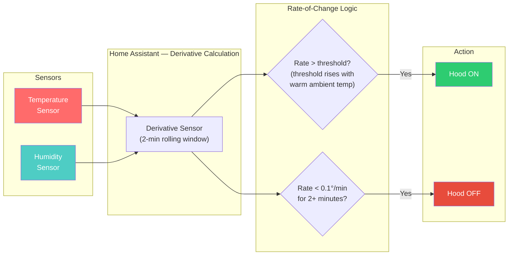

# How It Works

Most automations watch for a **temperature threshold** (e.g., "turn on when kitchen hits 26 °C"). This is slow because temperature lags behind actual cooking activity.

This package watches the **rate of change** — how many degrees the temperature changes per minute. It uses Home Assistant's built-in [derivative sensor](https://www.home-assistant.io/integrations/derivative/) to calculate this over a 3-minute rolling window, which smooths out brief spikes (a breath near the sensor, an open window, AC cycling) while still catching real cooking within about a minute.

### Real-World Example

Here's what an actual cooking session looks like on the dashboard:

The top bar shows the hood state (off → on → off). The middle graph is the rate of change — notice the sharp spike around 12:55 PM when cooking starts. The bottom graph is raw temperature climbing from ~20°C to ~35°C. The hood turned on within about a minute of the rate spike and off shortly after it dropped.

## Why Rate of Change Works Better

| Scenario | Threshold-based | Rate-of-change (this project) |
|----------|----------------|-------------------------------|
| Start cooking | Waits until kitchen heats up (5–10 min) | Detects rising temp within 30–60 sec |
| Stop cooking | Waits for kitchen to cool down (10–15 min) | Detects rate dropping within 2–3 min |
| Hot day, kitchen already warm | May trigger falsely | Ignores — temp isn't *changing* fast, and thresholds auto-stiffen when the room is warm |
| Open oven to check food | May trigger from heat blast | Brief spike smoothed by 3-min window |
| Muggy summer air / breathing near sensor | May trigger falsely | Warm-ambient boost raises the bar; 60-sec confirmation rejects transients |

## Key Integrations Used

- [Derivative sensor](https://www.home-assistant.io/integrations/derivative/) — calculates rate of change from raw temperature readings
- [Template sensor](https://www.home-assistant.io/integrations/template/) — combines temperature and humidity rate signals
- [Automation](https://www.home-assistant.io/docs/automation/) — triggers the hood on/off based on rate thresholds
